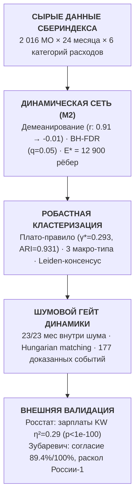
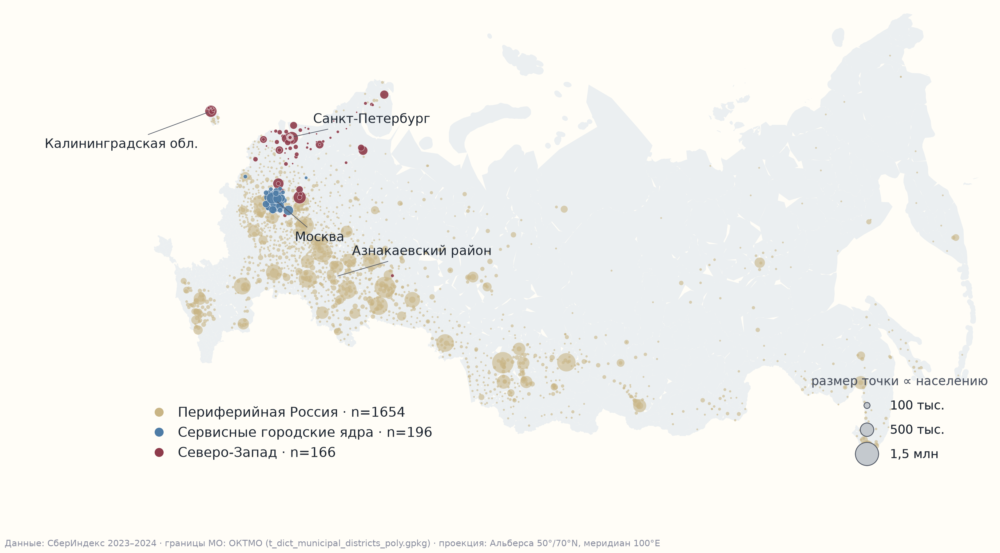

# Типология локальных экономик безналичной России в 2 016 муниципалитетах

[](https://www.python.org/)
[](report/methodology.md)
[](tests/)
[](Makefile)
[](https://creativecommons.org/licenses/by-sa/4.0/)

**Решение направления «Кластеризация» открытого конкурса Лаборатории СберИндекс 2026.**

---

### Быстрый доступ для жюри

| Материал | Формат | Описание |
|---|:---:|---|
| **[Презентация исследования](report/presentation.pdf)** | `PDF` | Официальная презентация решения (13 листов: постановка, 3 макро-типа, ICVI, внешняя валидация) |
| **[Методологический отчёт](report/methodology.md)** | `Markdown` | Полный академический отчёт со всеми разделами регламента (К1–К6, 8 этапов конвейера) |
| **[Чек-лист комплаенса](CRITERIA.md)** | `Markdown` | Карта «критерий жюри $\to$ раздел $\to$ число» (4 таблицы прямого комплаенса под чек-лист жюри) |
| **[Метки типов муниципалитетов](outputs/main/labels.csv)** | `CSV` | Закоммиченные итоговые метки всех 2 016 МО для мгновенной сверки |
| **[Интерактивная витрина](site/index.html)** | `Web / HTML` | Интерактивный веб-атлас типологии (GitHub Pages) |
| **[Индекс воспроизводимости](outputs/main/README.md)** | `Markdown` | Сквозной реестр: 31 артефакт $\to$ команда воспроизведения (`outputs/main/`) |

---

## 1. Краткое резюме исследования (Executive Summary)

### Задача
«Средний по региону» показатель скрывает реальную дифференциацию территорий. В проекте построена динамическая атрибутированная сеть **2 016 муниципальных образований России за 24 месяца (2023–2024)** по безналичным потребительским расходам СберИндекса (в рублях на душу населения по 6 категориям): выделены устойчивые макро-типы, исследована их эволюция, выявлены редкие доказанные переходы и проведена отложенная внешняя валидация по Росстату.

### Архитектурное решение: 8-этапный конвейер


---

## ⏱️ За 60 секунд (без ML-жаргона)

- **Объект анализа**: 2 016 муниципалитетов России × 24 месяца (2023–2024), помесячные безналичные траты жителей по 6 категориям (в рублях на душу населения).
- **Главный результат**: в России стабильно существуют ровно **три макро-уклада потребления**:
  1. *«Периферийная Россия»* (1 654 МО, 70.4% населения) — высокая доля трат на продукты (45.9%), низкая на рестораны (2.6%), высокая интеграция в маркетплейсы (14.0%).
  2. *«Сервисные городские ядра»* (196 МО, 19.2% населения) — столичные и региональные центры, развитая сервисная экономика, общепит 7.0%, средняя зарплата 115 тыс. ₽.
  3. *«Северо-Запад»* (166 МО, 10.5% населения) — города СЗФО и севера со специфической логистикой, автономным снабжением и повышенным средним чеком.
- **Внешняя валидация (независимый Росстат)**: типы не обучались на зарплатах, но строго их предсказывают ($H = 589.5, p < 10^{-100}, \eta^2_H = 0.29$). Макро-согласие с «Четырьмя Россиями» Зубаревич — **89.4%** по крупным городам и **100%** по периферии, а научная новизна — внутренний потребительский раскол агломерационной «России-1» на два типа (lift 5.46 и 4.40).
- **Сверхстабильность и честная динамика**: помесячный дребезг топологии отсекается шумовым фильтром (23/23 месяцев внутри шума); из 3 107 сырых смен меток фильтр допускает только **177 доказанных событий**: 173 события сезонной осенней волны 2023 года и 4 дебюта типов.
- **Воспроизводимость**: `make smoke` — весь сквозной пайплайн на подвыборке проверяется за 3 минуты; `make reproduce` — полный воспроизводимый цикл; 170 тестов (`make test`).



Без запуска кода: [паспорта типов](outputs/main/passports_macro.parquet) · [177 карточек переходов поимённо](outputs/main/transition_cards.parquet) · [метки всех методов (CSV)](outputs/main/labels.csv) · [реестр жизненного цикла типов](outputs/main/type_registry.parquet) · [карта соответствия критериям](CRITERIA.md)

---

## 2. Ключевые результаты в цифрах

### 1. Три устойчивых макро-уклада безналичной России (К4, К6)
- **Периферийная Россия (Тип 1):** 1 654 МО, 70.4% населения страны. Траты на еду — 45.9% корзины, общепит — 2.6%, маркетплейсы — 14.0%. Средняя зарплата Росстата — 48 тыс. ₽.
- **Сервисные городские ядра (Тип 2):** 196 МО, 19.2% населения страны. Доля еды падает до 33.3%, общепит возрастает до 7.0% (в 2.7 раза выше периферии), средняя зарплата — 115 тыс. ₽.
- **Северо-Запад (Тип 3):** 166 МО, 10.5% населения страны. Особая структура северного завоза и региональной логистики: траты на еду 36.1%, высокая автономность, средняя зарплата 86 тыс. ₽.
- **Закон Энгеля:** строгий отрицательный градиент доли продовольствия по типам ($\rho = -1.00$) при росте доходов.

### 2. Математическая строгость выбора $k=3$ и валидация ICVI (К2, К4)
- **Плато-правило устойчивости:** на плотной сетке из 13 значений параметра разрешения $\gamma$ зафиксирован единственный устойчивый пик при $\gamma^* = 0.293$ ($k=3$, медиана парного seed-ARI **0.9315**). В интервале $k \in [4, 10]$ устойчивого плато в данных нет (ARI $< 0.75$).
- **Полная панель 6 обязательных ICVI:** SW, CH/n, S_Dbw, AVI, AVU, MQ рассчитаны и сверены с библиотекой Pattern до $10^{-16}$.
- **Перестановочный нуль (200 перестановок):** разделение подтверждено на уровне $p < 0.005$ (SW $z=5.4$, CH/n $z=453$, AVI $z=174$, MQ $z=263$). Доказана математическая вырожденность AVU.
- **Бенчмарк мер:** мера M3 победила в формальном композите (0.398), но на графе выродилась в $k=1$. Итоговая типология построена на M2 (0.137) — важная методологическая находка «лучшая мера $\ne$ лучшая опора типологии».

### 3. Независимая внешняя валидация по Росстату и теории Зубаревич (К6)
- **Критерий Краскела–Уоллиса (KW):** валидация по независимым зарплатам Росстата дает $H = 589.5, p < 10^{-100}, \eta^2_H = 0.29$ — треть межмуниципальной дисперсии зарплат объясняется потребительскими типами без прямого обучения на них.
- **Концепция «Четырёх Россий» Н.В. Зубаревич:** макро-согласие составляет **89.4%** по крупнейшим городам и **100%** по периферии.
- **Научная новизна:** выявлен внутренний раскол классической «России-1» на два диаметрально противоположных потребительских уклада (сервисные ядра с лифтом 5.46 и периферийные центры с лифтом 4.40).
- **Отрицательный результат по моногородам:** моногорода не образуют обособленного кластера (лифт 1.14), опровергая гипотезу об их замкнутом потребительском поведении.

### 4. Сверхстабильность и честная динамика переходов (К3, К5)
- **Шумовой гейт динамики:** ARI соседних месяцев составляет 0.876 при пороге перестановочного шума 0.655. Шумовой фильтр отсекает 23 из 23 месяцев — структура сверхинертна, что публикуется как честный доказанный результат.
- **Воронка допуска событий:** из 3 107 сырых переходов после сглаживания и фильтрации остаётся ровно **177 доказанных событий** (173 события сезонного экскурса осени 2023 года и 4 дебюта типов).

### 5. Драйверы переходов и сценарный радар (К5, К6)
- **Интерпретируемые драйверы:** предпочтение отдано простой прозрачной модели `margin-rank` с эмбарго перед сложным бустингом (PR-AUC 0.0445 vs 0.0617 у LightGBM на h=3).
- **Сценарный радар:** выделены 202 муниципалитета в пограничной зоне (`radar_watchlist.parquet`) для упреждающего регионального мониторинга.
- **Клубы сходимости и лаги:** тест Phillips–Sul выявил 1 глобальный клуб сходимости по маркетплейсам; построен граф лаг-лидерства из 4 437 направленных связей (с проверкой на фазовых суррогатах и BH-FDR).

---

## 3. Матрица соответствия критериям конкурса

Полный детализированный чек-лист с 4 таблицами комплаенса доступен в документе **[CRITERIA.md](CRITERIA.md)**.

| Критерий | Вес | Результат исследования | Файл-доказательство |
|---|:---:|---|---|
| **К1 Простота методологии** | 15% | 8-этапный модульный конвейер, прозрачные правила, воспроизведение за 1 команду, быстрый smoke $< 3$ мин | `Makefile`, `configs/default.yaml`, §3 отчёта |
| **К2 Построение сети** | 15% | Демеанирование сняло spurious-эффект ($r: 0.91 \to -0.01$), отбор связей BH-FDR ($q=0.05$), $E^* = 12\,900$ | `src/ecotypes/graphs.py`, `outputs/main/graph_summary.json` |
| **К3 Сравнение методов** | 15% | 9 базовых алгоритмов 4 семейств + Leiden-консенсус; честный компромисс скорости и сетевой чистоты | `outputs/main/table_methods.parquet`, §4 отчёта |
| **К4 Панель ICVI** | 15% | Все 6 обязательных индексов (SW, CH/n, S_Dbw, AVI, AVU, MQ) сверены с Pattern до $10^{-16}$; перестановочный нуль | `src/ecotypes/icvi.py`, `outputs/main/icvi_null.parquet` |
| **К5 Интерпретация и валидация** | 30% | 89.4%–100% согласия с Зубаревич; раскол России-1; KW по зарплатам Росстата ($\eta^2_H=0.29$); закон Энгеля | `outputs/main/passports_macro.parquet`, `outputs/main/labels.csv`, §6 отчёта |
| **К6 Инновационная визуализация** | 10% | Картографический атлас в проекции Альберса (F0), веб-витрина GitHub Pages, паспорта типов, event-study | `report/figures/`, `report/presentation.pdf`, `site/index.html` |

---

## 4. Быстрый старт и воспроизводимость (Quickstart)

```bash
# 1. Установка зависимостей
uv sync                 # или: pip install -r requirements.txt

# 2. Проверка сырых данных
make data               # проверка целостности данных СберИндекса (SHA256)

# 3. Быстрый смоук-тест всего конвейера (< 3 минут)
make smoke              # сквозной прогон всех 8 этапов на 200 МО

# 4. Запуск полного набора тестов (170 тестов)
make test               # pytest tests/ (158 функциональных + 12 инвариантов)

# 5. Полное воспроизведение всех артефактов
make reproduce          # последовательный запуск всех 17 шагов пайплайна
```

---

## 5. Архитектура репозитория

```
├── configs/               # YAML-конфигурации: параметры сети, пороги, сиды
├── src/ecotypes/          # Исходный код расчетного ядра (модули конвейера)
│   ├── panel.py           # Построение панели и валидация
│   ├── graphs.py          # Построение динамической сети и фильтрация связей
│   ├── cluster.py         # Алгоритмы кластеризации и Leiden-консенсус
│   ├── dynamics.py        # Сшивка снимков, Hungarian matching, воронка событий
│   ├── measures.py        # 11 мер сходства временных рядов (M1..M11)
│   ├── icvi.py            # Полная панель 6 внутренних индексов качества
│   ├── interpret.py       # Паспортизация типов и расчет лифтов
│   └── drivers.py         # Драйверы переходов и сценарный радар
├── scripts/               # 17 тонких раннеров пайплайна (01_download ... 10_figure_map)
├── tests/                 # 170 тестов (unit, integration, audit invariants)
├── outputs/main/          # Закоммиченные итоговые витрины, паспорта и labels.csv
├── report/                # Академический отчёт, презентация (PDF) и визуализации
├── site/                  # Интерактивная веб-витрина для жюри (GitHub Pages)
├── CRITERIA.md            # Карта прямого соответствия критериям жюри
├── PREREG.md              # Документ предрегистрации методологии
└── Makefile               # Диспетчер воспроизводимости пайплайна
```

---

## 6. Результат → артефакт → команда

Полный сквозной реестр опубликован в [`outputs/main/README.md`](outputs/main/README.md) (31 артефакт, каждый с командой запуска и идентификатором прогона). Словарь переменных и колонок зафиксирован в [`DATA_DICTIONARY.md`](DATA_DICTIONARY.md).

---

## 7. Данные и лицензии

- **Код**: лицензия MIT.
- **Данные СберИндекса и производные таблицы**: CC BY-SA 4.0 (см. [`DATA.md`](DATA.md)).
- **Сторонние зависимости**: открытые лицензии (MIT, BSD, Apache 2.0; GPL-компоненты описаны в [`NOTICE`](NOTICE)).
- **Участие**: Открытый конкурс Лаборатории СберИндекс 2026, трек «Кластеризация».
