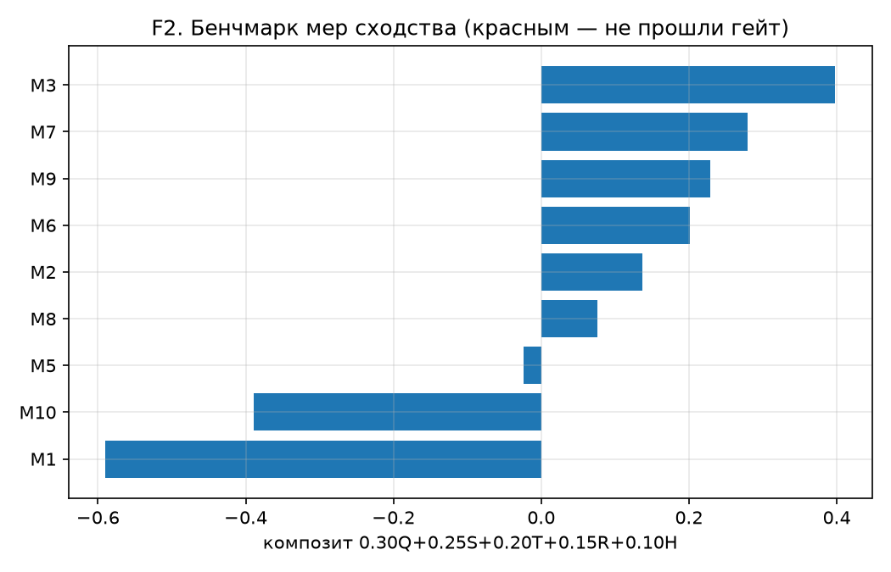
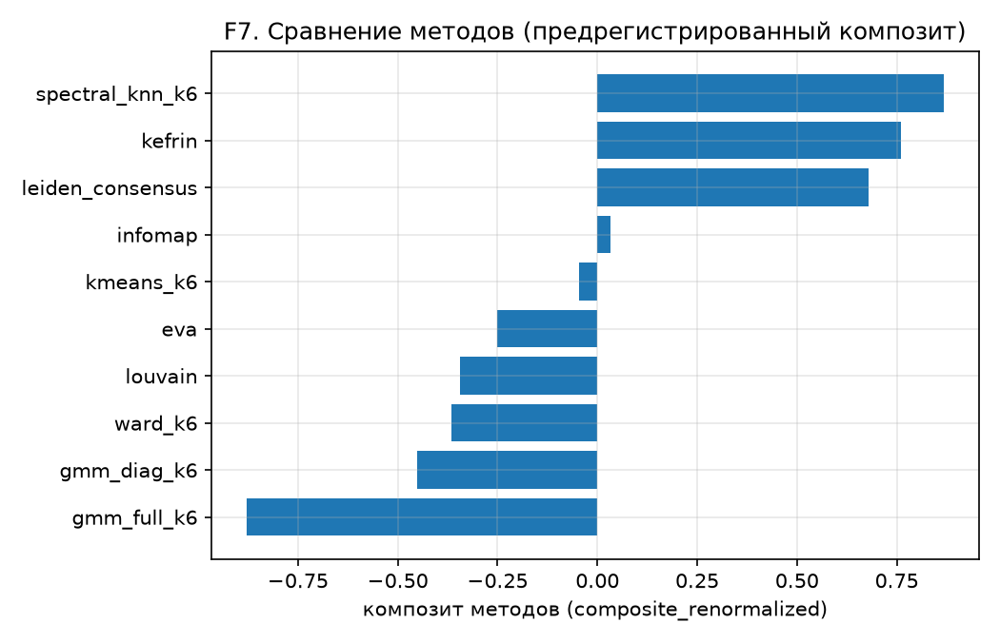
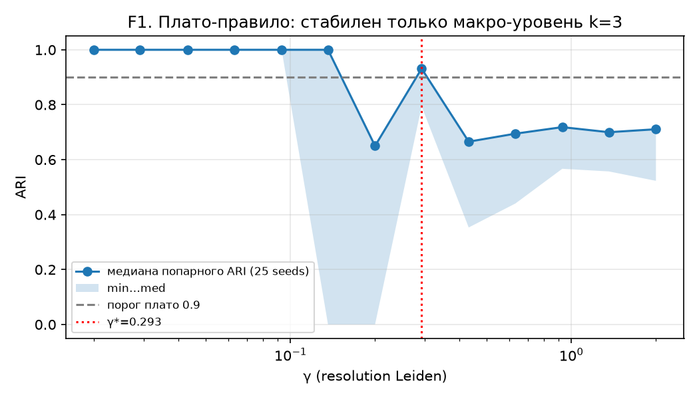
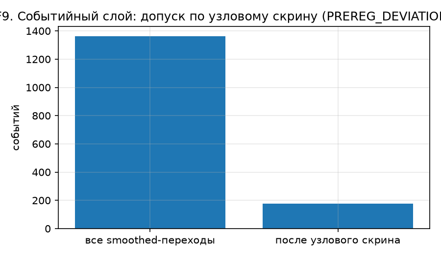
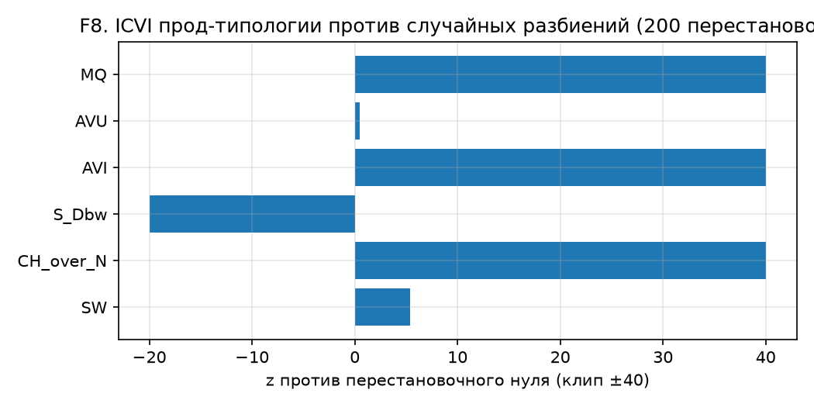
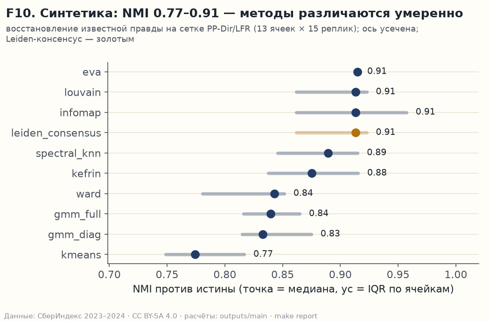
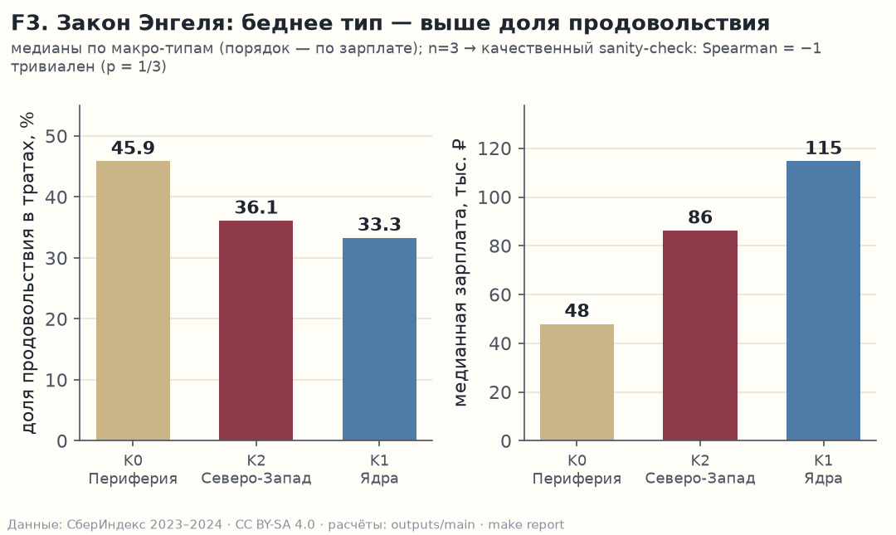
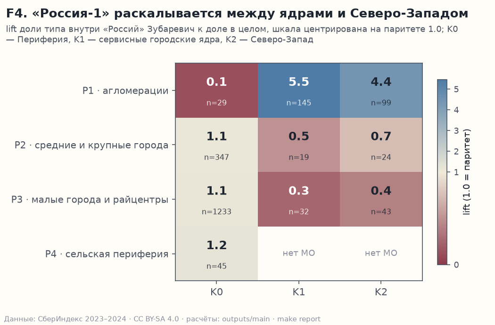
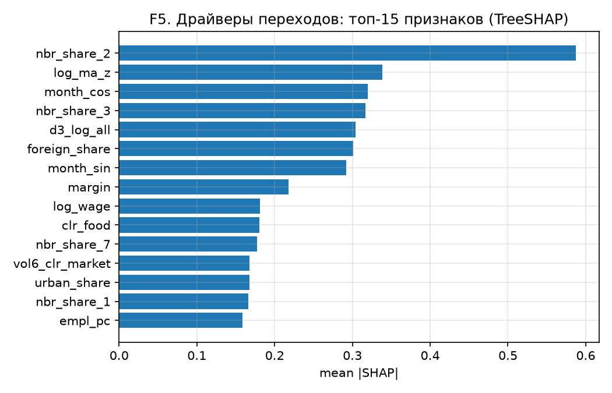
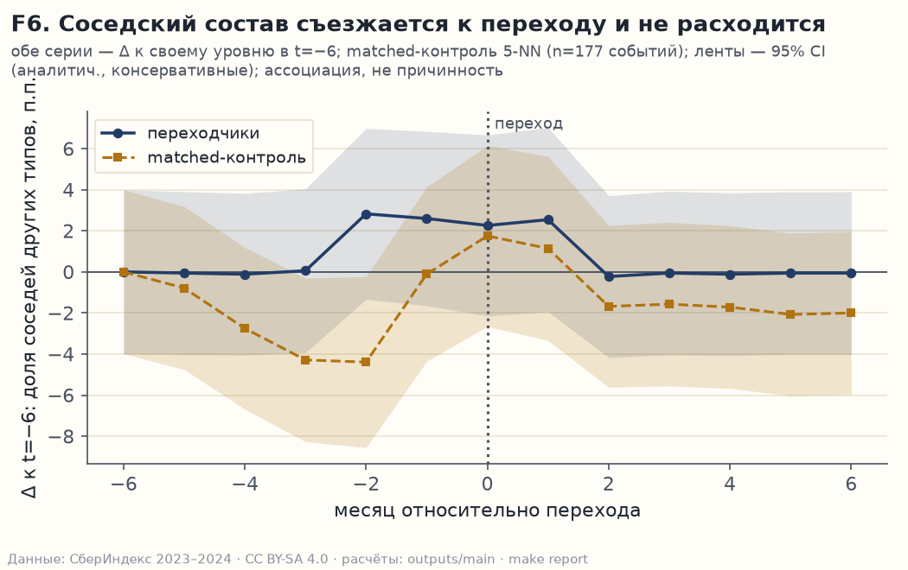

# Типы локальных экономик России по потреблению СберИндекс: динамическая атрибутированная сеть 2016 муниципальных образований

Методологический отчёт. Конкурс СберИндекс 2026, направление «Кластеризация».
Все ключевые числа отчёта генерируются кодом из артефактов `outputs/main/` (таблица соответствия «результат → команда» — в разделе 8 и в `outputs/main/README.md`); константы построения сети (12 900 рёбер, 0 изолятов, медианы корреляций) сведены из лога прогона графов в `outputs/main/graph_summary.json`, факт Jaccard 0.031 зафиксирован в docstring `src/ecotypes/graphs.py`.

## 1. Введение: «средний по региону» врёт — нужен бенчмарк «свой к своим»

Зачем это нужно. Среднее по региону или по стране почти ничего не говорит о конкретной территории: Татарстан при зарплате на уровне РФ тратит безналичными на 18% меньше, а нефтяной Азнакаевский район зарабатывает на 31% выше медианы своего типа — и при этом тратит как периферия. Региону и банку нужен не рейтинг против среднего, а сопоставимые муниципалитеты: пары «свой к своим», внутри которых сравнение честно, а расхождение — уже сигнал. Эта работа строит такой бенчмарк из структуры потребления.

Мы строим типологию локальных экономик России по структуре безналичного потребления: 2016 муниципальных образований (МО) × 24 месяца (2023-01…2024-12) × 6 категорий расходов (продовольствие, здоровье, маркетплейсы, общепит, транспорт, прочее). Задача конкурса — не только разбиение, но и (а) обоснованное построение сети сходства МО, (б) сравнение методов кластеризации, (в) полная панель внутренних индексов качества (ICVI), (г) интерпретация типов и их эволюции.

Три принципа работы. Первый — предрегистрация: веса композитов, пороги и протоколы зафиксированы до прогонов (тег `prereg-v1`), все отступления задокументированы в журнале отклонений (15 записей, включая реестры расхождений, найденных независимыми аудитами 07.10 и 09.10). Второй — отрицательные результаты публикуются наравне с положительными: то, что не сработало (меры, не прошедшие гейт; глобальный шумовой гейт динамики; слабые классификаторы переходов), — это результат, а не тайна. Третий — простота как дисциплина: за каждое усложнение мы платим измеримым эффектом. Не заплатили — блок не входит.

## 2. Данные: сходство сырых рядов вырождено инфляцией — работаем с остатками

Источник — открытые данные СберИндекса (CC BY-SA 4.0, скачаны 04.10.2026; хэши в `DATA.md`): потребительские расходы по МО (значения уже в рублях на жителя в месяц — население в расчётах не используется), справочник МО, автодорожные расстояния, индекс доступности рынков. Из 2190 рядов исключены 174 неполных (реестр исключений публикуется; структурные блоки — Бурятия только-2023, Дагестан и Чечня только-2024); преемники муниципальных реформ не склеиваются. Итоговая панель: 2016 МО × 24 мес = 48 384 строки.

Доли шести категорий переводятся в CLR-координаты (центрированное лог-отношение Аитчисона); нулей в долях нет, псевдосчётчики не нужны. Шестая компонента «прочее» (= 1 − Σ₅, медиана 28%) — полноценный сигнал, не остаток. Ключевой факт данных: сырые корреляции уровней вырождены (медиана r = 0.906 — все ряды растут вместе с инфляцией), поэтому сходство считается только по демеаненным остаткам. Внешние источники для валидации (не для кластеризации): Росстат БД ПМО (покрытие 1936/2016), перечень моногородов 1398-р, «Четыре России» Зубаревич, курортный сбор.

## 3. Метод: восемь этапов, каждое усложнение оплачено измеримым эффектом

Пайплайн — 8 нумерованных этапов (`make reproduce`), один конфиг `configs/default.yaml`:

1. **Панель**: сборка, фильтры полноты, CLR, десезонализация month-of-year, контекстные признаки Росстата (вне кластеризации).
2. **Сеть**: сходство МО — корреляции демеаненных остатков потребления; каркас рёбер = kNN(10, union) ∩ фильтр множественного тестирования BH-FDR(q=0.05) ∪ топ-3 safety net; гео-слой w = exp(−d/150 км) по автодорожным расстояниям; один общий набор рёбер + 24 вектора месячных весов (списки рёбер, перестроенные по половинам периода, почти не пересекаются — Jaccard 0.031, — поэтому помесячная топология признана шумом и не публикуется). Итог: 12 900 рёбер, 0 изолятов, 1 компонента.
3. **Кластеризация**: зоопарк из 9 методов четырёх парадигм (атрибутивные: k-means, Ward, GMM; сетевые: Leiden, Louvain, Infomap; атрибутированные: KEFRiN — своя реализация по Entropy 2022, EVA; спектральная). Одиночный Leiden недопустимо нестабилен (seed ARI 0.44–0.72) → в итоговой типологии консенсус CSPA из 25 seed-прогонов; число типов выбирается плато-правилом по стабильности, а не по силуэту.
4. **Динамика**: 24 независимых снимка Leiden-консенсуса, сшивка Hungarian (τ=0.3), сглаживание окном 3, реестр типов с рождениями/смертями/слияниями; глобальная проверка динамики на шум (ARI соседних месяцев против нуля 5%-пертурбации рёбер).
5. **Бенчмарк мер сходства** (11 мер + 3 анти-примера) и **синтетическая валидация** (генератор PP-Dir, откалиброванный под моменты данных, + LFR; 13 ячеек × 15 реплик).
6. **Интерпретация**: три независимых описателя (правило Миркина, суррогатное дерево, TreeSHAP) с мерой согласия; паспорта типов; протокол именования с честными отказами.
7. **Драйверы переходов**: LightGBM/логит на rolling-origin с эмбарго, TreeSHAP, event-study против matched-контроля.
8. **Клубы сходимости** Phillips–Sul (свой порт log-t теста) и **лаг-лидерство** (направленный граф «кто за кем следует»: phase-randomization суррогаты + BH-FDR).

## 4. Сравнение подходов: лучшая мера бенчмарка схлопывает типологию — измерительное качество и устойчивость структуры различны

**Меры сходства.** Предрегистрированный композит (0.30·качество ICVI + 0.25·стабильность + 0.20·темпоральная согласованность + 0.15·восстановление истины на синтетике + 0.10·структурная ценность) выиграла мера {{M_WINNER}} ({{M_WINNER_COMP}} против {{M_RUNNER_COMP}} у ближайшей {{M_RUNNER}}; отрыв ≥ 1 SE по парному бутстрэпу). Однако на графе {{M_WINNER}} плато-правило не находит ни одного стабильного нетривиального разбиения (вырождается в k=1), поэтому итоговая типология построена на сильнейшей мере, прошедшей плато-гейт (M2, демеаненные остатки). Расхождение «лучшая мера по бенчмарку ≠ лучшая опора типологии» мы считаем содержательной находкой, а не неудобством: измерительное качество и структурная устойчивость — разные свойства сети.

**Методы.** По предрегистрированному композиту методов (z(NMI на синтетике) + z(стабильность) + z(ICVI) + z(интерпретируемость) + z(тайминг⁻¹)) лидирует {{METHOD_WINNER_COMPOSITE_RENORMALIZED}} ({{METHOD_WINNER_COMPOSITE_RENORMALIZED_SCORE}}); итоговая типология — Leiden-консенсус как единственный метод с авто-k и плато-стабильностью на итоговом графе (обе версии композита — с ногой интерпретируемости и без — публикуются в `table_methods.parquet`; циркулярные пары индексов и методов помечены флагами). Заметное «неудобное» число публикуем, не прячем: k-means (при k=6) почти догоняет консенсус по устойчивости (0.9136 против 0.9178) при ~110× скорости. Консенсус всё же остаётся продом: k-means сам не выбирает число типов и не даёт сетевой чистоты типологии (MQ против нуля) — её даёт только сетевой метод. Синтетика ограничена по замыслу: SBM-подобное ядро генератора даёт сетевым методам домашнее преимущество (оговорка в таблицах); F1 детекции смены типа тождественно равен нулю у всех методов — это структурное свойство статических методов на дрейфующей синтетике, а не дефект реализации.

## 5. Результаты: стабилен один макро-уровень k=3, структура сверхинертна, переходы редки и доказуемы

**Типология.** Стабилен единственный нетривиальный уровень: k=3 макро-типа (γ*={{GAMMA_STAR}}, медиана попарного seed-ARI {{SEED_ARI_MED}}; плотная сетка из 13 значений γ показывает: на k∈[4,10] нигде нет ARI≥0.9). Бюджетного плато 4–10 типов в данных нет — поэтому публикуется иерархия: макро-слой k=3 + подтиповый слой с явной пометкой пониженной стабильности (ARI 0.67–0.72). Размеры макро-типов (по убыванию): {{MACRO_SIZES}} МО.

**Устойчивость против шума.** Помесячные перестройки типологии глобально неотличимы от шумового конверта топологии: ARI соседних месяцев {{ARI_MONTH}} против медианы пертурбационного нуля {{ARI_NULL}}, гейт отмечает {{N_FLAGGED}}/{{N_PAIRS}} пар (иными словами: соседние месяцы различаются на 0.12, а та же типология при случайном потрясении 5% рёбер — на 0.35; разница месяцев меньше шумовой во всех парах). Мы публикуем это как доказанный факт сверхинертности структуры (средний ARI типологий на горизонтах 1/3/6 мес — 0.88/0.88/0.86, медианы 0.90–0.92), а переходы допускаем только через узловой отбор доказательности: отсутствие мерцания, согласие seed-прогонов ≥ 0.8 и материальный сдвиг профиля (≥ q75 по всем узел-месяцам). Из 3107 сырых смен меток отбор пропускает {{N_EVENTS_ADMITTED}} доказуемых перехода — это и есть событийный слой работы.

**Жизненный цикл типов (реестр динамики).** Помесячный слой — девять типов с явными рождениями и смертями (smoothed-метки; карта в макро-слой — `type_id_map.parquet`):

| Тип | Рождение | Смерть | Судьба | Размер, МО (мин/медиана/макс) |
|---|---|---|---|---|
| 0 | 2023-01 | — | живёт весь период | 265 / 582 / 645 |
| 1 | 2023-01 | — | живёт | 480 / 531 / 647 |
| 2 | 2023-01 | — | живёт | 342 / 378 / 384 |
| 3 | 2023-01 | — | живёт | 181 / 188 / 191 |
| 4 | 2023-01 | 2023-12 | слит в тип 0 (сезонный экскурс) | 159 / 205 / 537 |
| 5 | 2023-01 | 2023-06 | влит в тип 1 | 102 / 110 / 158 |
| 6 | 2023-08 | — | родился из типа 1 | 108 / 133 / 173 |
| 7 | 2023-12 | — | родился из типа 4 (поселение Киевский, Новая Москва) | 159 / 204 / 220 |
| 8 | 2024-10 | 2024-10 | вспышка ровно на один месяц — артефакт, не интерпретируем | 230 / 230 / 230 |

Сезонный экскурс типа 4 читается поимённо: 57 МО вошли в ноябре 2023, 116 вышли в январе 2024 (`transitions_quarterly.csv`). Тип 7 — единственное рождение с доказуемым событием-источником (карточки переходов). Тип 8 — одномесячная вспышка на ровно 2024-10: читаем как артефакт помесячного слоя, а не как экономику — и потому публикуем в реестре с пометкой, а не в выводах.

**ICVI.** Все шесть требуемых индексов (SW, CH/n, S_Dbw, AVI, AVU, MQ в первичной форме Mancoridis 1998; сумма TurboMQ растёт механически с k и используется только как абляция) посчитаны и сверены с библиотекой Pattern до машинной точности. Значимость против случайных разбиений (200 перестановок меток, кардинальности сохранены): {{ICVI_NULL_Z}} — типология далека от случайной по всем индексам, кроме AVU, у которого нулевое распределение при n≈2000 почти вырождено (оговорка: z там читается только вместе с null_std).

**Синтетика.** На откалиброванной синтетике лучшие методы восстанавливают истину с NMI 0.92 (потолок при дрейфе 7.5% — 0.906 пересчитан кодом); ранжирование методов устойчиво по 13 ячейкам.

## 6. Интерпретация: типы читаются как понятия — и раскалывают «Россию-1» надвое

**Макро-типы** (паспорта с полным evidence pack — `passports_macro.parquet`; имена утверждаются формальным протоколом: имя должно покрывать ≥ 60% территорий типа и встречаться там минимум вдвое чаще среднего по стране): тип 0 — **Периферийная Россия** (бóльшая часть МО; имя по исключению — протокол честно отказал всем категорийным кандидатам, и это опубликовано), тип 1 — **Сервисные городские ядра** (протокол пройден дважды), тип 2 — **Северо-Запад** (93% территорий типа — СПб, Ленобласть, Карелия, Калининград, Псков, Новгород, Мурманск; перевес 9,0× против случайного; согласие описателей 0,23 помечено спорным). Профили: доля продовольствия {{ENGEL_FOOD}}% против градиента зарплат {{ENGEL_WAGE}} тыс. ₽ — порядок согласуется с законом Энгеля (качественный чек: при n=3 Spearman=−1 статистически тривиален, p=1/3 — публикуем с оговоркой). По доле маркетплейсов периферия не уступает городам: волна маркетплейсов — периферийное явление, она идёт не из столиц на окраины, а во все стороны сразу.

**Диалог с «Четырьмя Россиями» Зубаревич.** Наше потребительское пространство раскалывает «Россию-1» на два разных типа (lift {{R1_LIFTS}}) — главная новизна типологии: агломерационная Россия не едина по структуре безналичного потребления. Согласие на макро-уровне: 244/273 (89,4%) территорий «России-1» — в городских типах 1+2, 45/45 (100%) «России-4» — в периферии; новизна — именно во внутреннем разрезе «России-1». Моногорода как тип не выделяются (lift 1.14 в их основном типе; максимум по ячейкам {{MONO_LIFT_MAX}} — отрицательный результат): моногород — это не потребительский портрет, а институциональный.

**Переходы и их драйверы.** На {{N_EVENTS_ADMITTED}} доказуемых переходах: прогнозная модель смены типа на горизонте 3 мес достигает PR-AUC {{PRAUC_H3_LGBM}} против {{PRAUC_H3_MARGIN}} у рангового базлайна и {{PRAUC_H3_BASE}} у угадывания по частоте (PR-AUC — качество ранжирования редкого события; доля событий = бесплатный уровень); на горизонте 1 мес модель не работает — публикуем как есть. Публикуемая модель: {{VERDICT_PUBLISH}}; margin_rank — ранжирование без обучения: территории сортируются по «запасу близости» (насколько точка глубже центроида своего типа, чем ближайшего чужого) — кто на границе типов, тот и кандидат на переход. Абсолютная сила моделей невысока — переходы редки и шумны; ценность блока в объяснимости (TreeSHAP-профили по каналам переходов, карточки 177 событий поимённо) и в event-study: сдвиги профиля видны за месяцы до события и не возвращаются после. Кейс сезонного экскурса типа 4 (осень 2023 → январь 2024) читается в карточках переходов дословно; кейс Азнакаевского района — «зарплата ≠ безналичное потребление» (зарплата на 31% выше медианы своего типа при периферийном профиле трат).

**Клубы сходимости и лаг-лидерство.** По маркетплейсам+продовольствию Россия сходится в один глобальный клуб ({{CLUBS_MPFOOD}} клуб по критериям log-t/σ/β) — при том что типология остаётся трёхчастной: сходимость идёт внутри типов, не стирая их. Направленный граф лаг-лидерства: {{LEAD_EDGES}} значимых направленных связей (FDR q=0.05, phase-randomization суррогаты) из {{LEAD_PAIRS}} проверенных пар; топ-«маяки» — преимущественно периферийные МО с высокой исходящей степенью.

**Внешняя валидация.** Татарстан целиком (43/43 МО) в типе 0 при зарплате на уровне РФ — региональный сюжет «зарплата равна, безналичное потребление ниже»; курортные МО имеют повышенную летнюю амплитуду продовольствия; согласие трёх описателей по типам публикуется полностью, включая спорный тип (согласие 0.23 помечено в паспорте). Типы различаются и по внешним источникам, не входившим в кластеризацию (Краскел–Уоллис по типам): зарплата Росстат H = 589.5, p < 1e-100, η²_H = 0.29; доступность рынков H = 645, η²_H = 0.32 (k = 3, n = 2016). Честная оговорка: регионы объясняют больше (η²_H = 0.70–0.92) — типы не замена регионов, а разрез внутри них; стратифицированный нуль «внутри регионов»: η²_H (доступность рынков) = 0.320 против медианы нуля 0.303 (p95 = 0.307, p < 0.005) — надбавка мала, публикуем как есть.

## 7. Ограничения: что данные не позволяют утверждать

1. Окно данных — 24 месяца (2023–2024); данных 2025 на уровне МО не существует — out-of-time проверка невозможна и нигде не заявляется; радар смены типов помечен `unverified=true`.
2. Макро-типов три — данные не поддерживают стабильную более мелкую типологию; подтипы даны с пометкой пониженной стабильности. Макро-уровень частично совпадает с общеизвестной стратификацией (центр/северо-запад/периферия) — новизна переносится на разрез «России-1», динамику и переходы.
3. Глобальный шумовой гейт динамики срабатывает на всех парах месяцев — помесячная эволюция как массовое явление не доказуема; событийный слой — только узловой и доказательный.
4. Безналичные траты ≠ все расходы (наличные, натуральное хозяйство); типология — про цифровое потребление.
5. Прогнозная сила драйверов переходов умеренная (редкий класс); SHAP-профили — ассоциации, не причинность; event-study — против matched-контроля, не против рандомизации.
6. 174 МО исключены за неполнотой; 10 МО-«островов» вне дорожной сети работают на great-circle fallback.
7. Часть протокольных расхождений (seeds плато-гейта 25 вместо 30, правило ari_min, версии fallback) найдена независимым аудитом уже после прогонов и зафиксирована в журнале отклонений №13; ни одно не влияет на итоговые выборы.

## 8. Воспроизводимость: каждое число — одной командой

Полный прогон: `uv sync && make data && make reproduce` (ядро — часы CPU; smoke на подвыборке — минуты). Каждая таблица и фигура отчёта адресуема: соответствие «артефакт → скрипт → команда → run» ведётся в `outputs/main/README.md`; снапшоты конфигов и логи — в `outputs/<run_id>/`; предрегистрация и журнал отклонений — `PREREG.md`, `PREREG_DEVIATIONS.md` (тег `prereg-v1`). Тесты: `uv run pytest -q`. Словарь данных артефактов — `outputs/main/DATA_DICTIONARY.md`.

Фигуры: F1 плато-правило; F2 бенчмарк мер; F3 Энгель-чек; F4 «Четыре России»; F5 SHAP-драйверы; F6 event-study; F7 композит методов; F8 ICVI против нуля; F9 воронка событий; F10 синтетика (`report/figures/`, генерируются `make report`).
